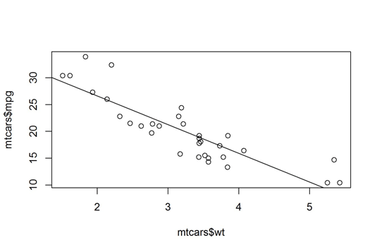

```{r setup, include=FALSE}
knitr::opts_chunk$set(echo = TRUE)
```

## Intro



* Model Uses

  + numeric predictions based on a linear relationship between predictor and response variable.
  + calculate the extent to which a response variable may be linearly related to a predictor variable (
  + calculate which of the predictor variables (if any) are statistically significant. 
  
* Model Shape
  
  + $y = b + m_1x_1 + m_2x_2 + ...$
  + Multiple vs. Single Linear Regression
  + plot shape in Wolfram Alpha
  
* Model Fitting

  + Draw line at minimum error
  
* Model Input

  + Continuous and not discrete
  
* Model Output

  + Continuous (regression)
  
## Data Import and Cleaning

> Analysis Question: How well can we predict, using a linear model, county-level political (presidential) leanings given education level and previous levels of voter turnout?

```{r, message=FALSE, warning=FALSE}
library(readr)

setwd('/Users/drewhowell/Desktop/CSC-201/2020_Fall/20201019_Linear_Models/')

education <- read_csv('education_county.csv')
voted <- read_csv('voted_county.csv')
pops <- read_csv('populations_county.csv')

voted$ID <- paste(voted$county, voted$state_po)
voted <- voted[voted$year == max(voted$year),]
voted$version <- NULL

ids <- unique(voted$ID)


i=2820
for (i in 1:length(ids)){

  temp <- voted[voted$ID == ids[i],]
  if(!F %in% is.na(temp$candidatevotes)){
    next
  }
  temp$spectrum <- (-as.numeric(na.omit((temp$candidatevotes[temp$party=='democrat']/temp$totalvotes[temp$party=='democrat'] *10))) + 
    as.numeric(na.omit((temp$candidatevotes[temp$party=='republican']/temp$totalvotes[temp$party=='republican'] *10))))[1]
  x <- temp[temp$candidatevotes == max(temp$candidatevotes),]
  
  if(i==1){
    clean_voted <- x
  } else {
    clean_voted <- rbind(clean_voted, x)
  }
}

education <- education[!is.na(education$`2003 Rural-urban Continuum Code`),]
education$ed_spectrum <- -(2*education$`Percent of adults with less than a high school diploma, 2014-18` + 
  education$`Percent of adults with a high school diploma only, 2014-18`) + 
  education$`Percent of adults completing some college or associate's degree, 2014-18` +
  education$`Percent of adults with a bachelor's degree or higher, 2014-18`*2

library(dplyr)
education <- select(education, State, `Area name`, ed_spectrum)
education <- education[-1,]  
education$`Area name` <- gsub(' County','', education$`Area name`)  
education$ID <- paste(education$`Area name`, education$State)
education$State <- education$`Area name` <- NULL

df <- inner_join(clean_voted, education, by = c('ID' = 'ID'))

pops$CTYNAME <- gsub(' County','', pops$CTYNAME) 
for(i in 1:nrow(pops)){
  pops$STNAME[i] <- ifelse(length(state.abb[grep(pops$STNAME[i], state.name)])==0, NA, state.abb[grep(pops$STNAME[i], state.name)])
}
pops$ID <- paste(pops$CTYNAME, pops$STNAME)

pops <- select(pops, ID, POPESTIMATE2019)
pops <- pops[!duplicated(pops$ID),]

df <- inner_join(df, pops)

df$turnout <- df$totalvotes / df$POPESTIMATE2019
df <- df[df$turnout < 1,]

```

## Modelling

```{r, message=FALSE, warning=FALSE}

mean(df$spectrum)
sum(df$POPESTIMATE2019 * df$spectrum) / sum(df$POPESTIMATE2019)


model <- lm(spectrum ~ turnout + ed_spectrum, df)
model_a <- lm(spectrum ~ turnout, df)
model_b <- lm(spectrum ~ ed_spectrum, df)

library(jtools)
summ(model)
summ(model_a)
summ(model_b)

```
### Interpreting the output

* p-value
  + measures the significance of your results
  + hypothesis testing
* R-squared
  + measures how much of the data is explained by your model


## Modelling with Normalized Predictors
```{r, message=FALSE, warning=FALSE}

normalize <- function(x){
  return((x - min(x))/(max(x) - min(x)))
}

df$ed_spectrum <- normalize(df$ed_spectrum)
df$turnout <- normalize(df$turnout)

model <- lm(spectrum ~ turnout + ed_spectrum, df)
model_a <- lm(spectrum ~ turnout, df)
model_b <- lm(spectrum ~ ed_spectrum, df)

summ(model)
summ(model_a)
summ(model_b)

```

## Visualizing the Model
```{r, message=FALSE, warning=FALSE}
library(ggplot2)
ggplot(df, aes(turnout, spectrum)) + 
  geom_point() + 
  geom_smooth(method='lm')

ggplot(df, aes(ed_spectrum, spectrum)) + 
  geom_point() + 
  geom_smooth(method='lm')
```