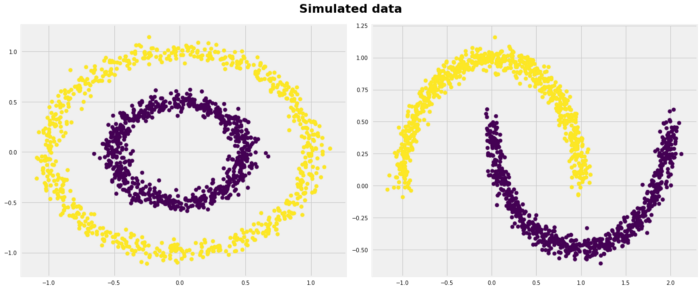
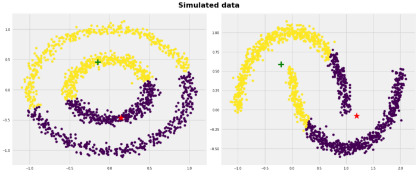

```{r setup, include=FALSE}
knitr::opts_chunk$set(echo = TRUE)
```

## Intro


* Model Uses
  + exploratory data analysis (which/how many intrinsic groups are there?)
  + unsupervised classification
  
* Model Input
  + Continuous and not discrete
  
* Model Output
  + Discrete categorical
  
* [Model Fitting Algorithm](http://shabal.in/visuals/kmeans/1.html)
  1. Assign k random points (centroids) in data space
  2. Assign each point to a group with the nearest value of k
    + 
    + 
  3. Update the location of each centroid by calculating the mean of all points assigned to it
  4. Reassign points based on distance to new position of centroids
  5. Repeat steps 3 and 4 until either {centroids no longer move} or {number of iterations reaches set limit}
  

  
## Differences from previous models

  * Supervised vs. Unsupervised
    + Supervised fitted to set response variable. Requires training and testing data for full evaluation
      + More Control
    + Unsupervised derives predicted variable from whole data set
      + Less Control
    
  * Algorithm-based vs. Function-based
  
## Analysis Example

> Analysis Question: What is the best way to group US States based on crime data?

[Data Documentation](https://stat.ethz.ch/R-manual/R-devel/library/datasets/html/USArrests.html)

```{r, message=FALSE, warning=FALSE}
data("USArrests")# Loading the data set

df <- USArrests
df <- scale(USArrests) # Scaling the data

# set.seed(123)
km.res <- kmeans(df, 3, nstart = 25)
print(km.res)

aggs <- aggregate(USArrests, by=list(cluster=km.res$cluster), mean)
dd <- cbind(USArrests, cluster = km.res$cluster)

km.res$size
km.res$centers

library(ggplot2)
ggplot() + 
  geom_point(data = dd, aes(x=Murder, y=Assault), color = dd$cluster) + 
  geom_point(data = as.data.frame(aggs), aes(x = Murder, y = Assault, size = 10))


library(factoextra)
fviz_nbclust(df, kmeans, method = 'wss') #+ geom_vline(xintercept = 4, linetype = 2)


```

## Possible disadvantages







