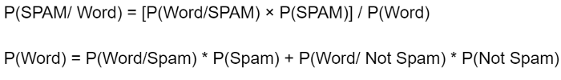

```{r setup, include=FALSE}
knitr::opts_chunk$set(echo = TRUE)
```

## Intro


* Model Uses
  + Classification on smaller data sets
  + supervised text classification

* Model Input
  + Binary
  
* Model Output
  + Discrete categorical
  
* Model Fitting Algorithm
  1. Calculate likelihood of case case being true, given that a predictor variable is positive.
  2. Get product of all likelihoods of positive predictors for an observation
  3. Compare to calculation for likelihood of positive case not being true, assign to highest probability

  
  
  

  


```{r, message=FALSE, warning=FALSE}
set.seed(1234)    #Setting seed
setwd("C:/Users/drew.howell/Desktop/CSC-201/2020_Fall/20201028_Naive_Bayes")    #Setting working directory

library(readr)
spamhamdataset <- read_delim("SMSSpamCollection", '\t',col_names = F)   
names(spamhamdataset) <- c('type','text')
spamhamdataset$text <- as.character(spamhamdataset$text)    #Typecasting the 'text' variable as character
str(spamhamdataset)   #Short summary of the dataset
```


```{r, message=FALSE, warning=FALSE}
library(wordcloud)  
wordcloud(spamhamdataset$text, max.words = 100, random.order = FALSE, colors = brewer.pal(7, "Accent"))   #Making a wordcloud

prop.table(table(spamhamdataset$type)) 
```


```{r, message=FALSE, warning=FALSE}
library(tm)
library(SnowballC)    #For making wordcloud
library(RColorBrewer)
library(e1071)
library(caret) 

sms_corpus = VCorpus(VectorSource(spamhamdataset$text))
as.character(sms_corpus[[1]])

corpus_clean = tm_map(sms_corpus, content_transformer(tolower))
as.character(corpus_clean[[1]])

corpus_clean = tm_map(corpus_clean, removePunctuation)
as.character(corpus_clean[[1]])

corpus_clean = tm_map(corpus_clean, stemDocument)
as.character(corpus_clean[[1]])

corpus_clean = tm_map(corpus_clean, removeWords, stopwords("en"))
as.character(corpus_clean[[1]])

sms_dtm <- DocumentTermMatrix(corpus_clean)

sms_dtm

reverse_sms <- data.frame(text = sapply(corpus_clean, as.character), stringsAsFactors = FALSE, type = spamhamdataset$type)

wordcloud(reverse_sms$text, max.words = 150, colors = brewer.pal(7, "Dark2"), random.order = FALSE)


spam <- subset(reverse_sms, type == "spam")
wordcloud(spam$text, max.words =50, colors = brewer.pal(7, "Dark2"), random.order = FALSE)

ham <- subset(reverse_sms, type == "ham")
wordcloud(ham$text, max.words = 60, colors = brewer.pal(7, "Dark2"), random.order = FALSE)
```


```{r, message=FALSE, warning=FALSE}
sms_dtm_train <- sms_dtm[1:floor(nrow(sms_dtm)*0.8), ]
sms_dtm_test <- sms_dtm[ceiling(nrow(sms_dtm)*0.8):nrow(sms_dtm), ]

sms_train_labels <- as.factor(unlist(spamhamdataset[1:floor(nrow(sms_dtm)*0.8), ]$type))
sms_test_labels <- as.factor(unlist(spamhamdataset[ceiling(nrow(sms_dtm)*0.8):nrow(sms_dtm), ]$type))

prop.table(table(sms_train_labels))
prop.table(table(sms_test_labels))

threshold <- 0.1
min_freq = round(sms_dtm$nrow*(threshold/100),0)
min_freq

freq_words <- findFreqTerms(x = sms_dtm, lowfreq = min_freq)
str(freq_words)

sms_dtm_freq_train <- sms_dtm_train[ , freq_words]

sms_dtm_freq_test <- sms_dtm_test[ , freq_words]

dim(sms_dtm_freq_train)
dim(sms_dtm_freq_test)

convert_values <- function(x) {
  x <- ifelse(x > 0, "Yes", "No")
}

sms_train <- apply(sms_dtm_freq_train, MARGIN = 2,
                   convert_values)
sms_test <- apply(sms_dtm_freq_test, MARGIN = 2,
                  convert_values)
```

```{r, message=FALSE, warning=FALSE, cache=TRUE}
sms_classifier <- naiveBayes(sms_train, sms_train_labels)

sms_test_pred <- predict(sms_classifier, sms_test)

confusionMatrix(data = sms_test_pred, reference = sms_test_labels,
                positive = "spam", dnn = c("Prediction", "Actual"))
```