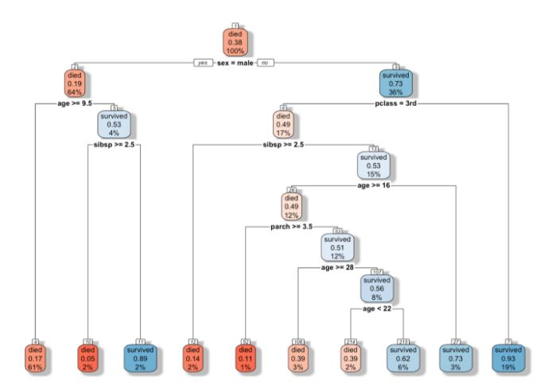
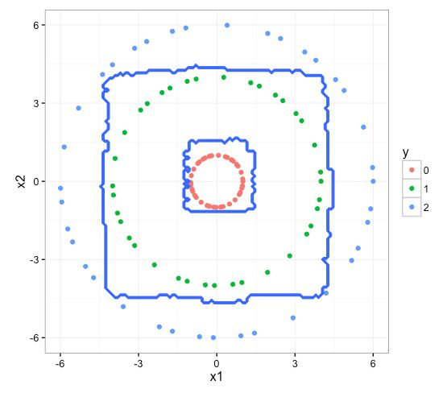
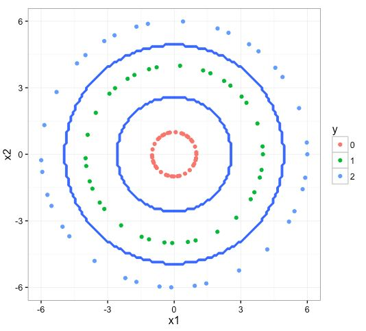
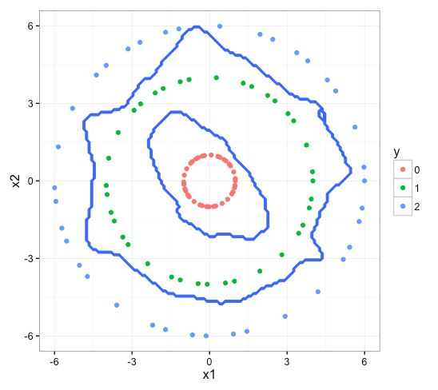

```{r setup, include=FALSE}
knitr::opts_chunk$set(echo = TRUE)
```

## Intro
{width=100%}


* Model Notes:
  + random forest is a aggregation of multiple decision tree models
  + decision boundary is in the form of several rectandular sections
  + robust to different types of analysis, but prone to overfitting - must be "pruned"

* Model Uses
  + Classification, some regression
  + supervised machine learning

* Model Input
  + Countinuous and discrete
  
* Model Output
  + Discrete, but can also perform regression
  
* Model Fitting Algorithm
  + Decision tree
    + separate on variables that provide the most distinction between classes
    + continue separating until max depth has been reached 
  + Random Forest
    + run several decision trees at set depth, selecting variables to split on by choosing the best one among a preset number of randomly chosen variables from the test set. 
    + aggregate the models into one tree

{width=100%}

### RF Decision Boundary
{width=100%}

### SVM Decision Boundary
{width=100%}

### Neural Net Decision Boundary
{width=100%}

### Example

* age: age in years
* sex: sex (1 = male; 0 =female)
* cp: chest pain type (1 = typical angina; 2 = atypical angina; 3 = non-anginal pain; 4 = asymptomatic)
* trestbps: resting blood pressure (in mm Hg on admission to the hopsital)
* choi: serum cholestoral in mg/dl
* fbs: fasting blood sugar > 120 mg/dl (1 = true; = 0 false)
* restecg: resting electrocardiographic results (1 = normal; 2 = having ST-T wave abnormality; 2 = showing probable or definite left ventricular * hypertrophy)
* thalach: maximum heart rate achieved
* exang: exercise induced angina (1 = yes; 0 = no)
* oldpeak: ST depression induced by exercise relative to rest
* slope: the slope of the peak exercise ST segment (1 = upsloping; 2 = flat; 3 = downsloping)
* ca: number of major vessels (0–3) colored by flourosopy
* thai: (3 = normal; 6 = fixed defect; 7 = reversable defect)
* num: diagnosis of heart disease. It is an integer valued from 0 (no presence) to 4.
```{r, warning=FALSE, message=FALSE}
library(randomForest)
require(caTools)

data <- read.csv(
  "C:/Users/drew.howell/Desktop/CSC-201/2020_Fall/20201102_Random_Forest/processed.cleveland.data",
  header=FALSE
)

dim(data)
names(data) <- c("age", "sex", "cp", "trestbps", "choi", "fbs", "restecg", "thalach", "exang", "oldpeak", "slope", "ca", "thai", "num")

data$num[data$num > 1] <- 1

sapply(data, class)

data <- transform(
  data,
  age=as.integer(age),
  sex=as.factor(sex),
  cp=as.factor(cp),
  trestbps=as.integer(trestbps),
  choi=as.integer(choi),
  fbs=as.factor(fbs),
  restecg=as.factor(restecg),
  thalach=as.integer(thalach),
  exang=as.factor(exang),
  oldpeak=as.numeric(oldpeak),
  slope=as.factor(slope),
  ca=as.factor(ca),
  thai=as.factor(thai),
  num=as.factor(num)
)
sapply(data, class)

data[ data == "?"] <- NA
colSums(is.na(data))

data$thai[which(is.na(data$thai))] <- as.factor("3.0")
data <- data[!(data$ca %in% c(NA)),]
colSums(is.na(data))
summary(data)

data$ca <- factor(data$ca)
data$thai <- factor(data$thai)
summary(data)


sample = sample.split(data$num, SplitRatio = .75)
train = subset(data, sample == TRUE)
test  = subset(data, sample == FALSE)
dim(train)
dim(test)

rf <- randomForest(
  num ~ .,
  data=train
  ,mtry = 6
  ,ntree = 500
)
rf

pred = predict(rf, newdata=test[-14])

cm = table(test[,14], pred)

library(caret)
gbmImp <- varImpPlot(rf, type=2)

library(rpart)
fit=rpart(num ~ .,
          data=train)
plot(fit) 
text(fit)

```

[Article Source](https://towardsdatascience.com/random-forest-in-r-f66adf80ec9)